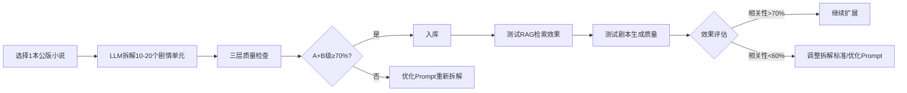

# AI漫剧RAG系统：数据质量与去AI化设计方案

## 📋 文档概述

本文档针对AI漫剧剧本生成系统的三个核心问题提出解决方案：

1. **RAG数据积累策略**：如何构建高质量的剧情知识库
2. **去AI化方案**：如何让生成的剧本更自然、更有文学性
3. **模型选择与成本控制**：合理的模型组合和成本预估

---

## 🎯 总体策略

### 核心原则

```
质量 > 数量 > 多样性
MVP验证优先，快速迭代
明确止损标准，控制投入风险
```

### 优先级排序

| 优先级 | 目标 | 检查点 | 止损标准 |
|-------|------|-------|---------|
| **P0** | 检索质量 > 70% | 第1周 | 相关性 < 60% 时调整策略 |
| **P0** | 生成可用性 > 60% | 第1周 | 可用性 < 40% 时优化Prompt |
| **P1** | 性能优化 < 30秒 | 第2周 | 超时 > 60秒 时优化索引 |
| **P2** | 去AI化效果改善 | 第3周 | 无明显改善时暂停投入 |
| **P2** | 模型网关引入 | 需要时 | 成本超预算时回退本地模型 |

---

## 📊 一、RAG数据积累策略

### 1.1 当前数据状况

| 数据类型 | 数量 | 质量评估 | 说明 |
|---------|------|---------|------|
| 上传文件 | ~40个 | ❌ 低 | 主要是测试文件 |
| 小文件（109字节） | ~15个 | ❌ 极低 | 仅含简单测试文本 |
| 评估文件（1181字节） | ~25个 | ⚠️ 中 | 有一定内容 |
| 已拆解文件 | ~4个 | ⚠️ 待验证 | 每个仅2个剧情单元 |
| 未拆解文件 | ~30+ | N/A | 尚未处理 |

**结论**：当前RAG库内容严重不足，无法支撑高质量检索。

### 1.2 MVP阶段数据量（推荐）

#### 最小可用配置（快速验证）

```
3-5本 精选小说
├─ 每本10-20章
├─ 每章拆解3-5个剧情单元
└─ 总计约100-500个剧情单元
```

#### 扩展配置（功能完善）

```
10本 优质小说
├─ 每本30-50章
├─ 每章拆解3-5个剧情单元
└─ 总计约1000-2500个剧情单元
```

**数据量建议对比**

| 阶段 | 原方案 | 修正方案 | 理由 |
|-----|-------|---------|------|
| MVP | 10-20本 | 3-5本 | 快速验证，降低前期投入 |
| 扩展 | 50-100本 | 10本 | 控制成本，质量优先 |
| 规模化 | 10000-50000单元 | 1000-2500单元 | 现实可行，避免过度设计 |

### 1.3 数据质量优先级

```
质量 > 数量 > 多样性
```

#### 优质数据特征

| 维度 | 评估标准 | 权重 | 最小要求 |
|-----|---------|------|---------|
| 剧情结构 | 冲突明确、高潮突出、转折自然 | 40% | 有明确的冲突点 |
| 人物设定 | 性格鲜明、动机清晰 | 30% | 人物有明确动机 |
| 对话质量 | 自然、符合人物身份 | 20% | 对话不生硬 |
| 节奏控制 | 张弛有度 | 10% | 有起伏变化 |

#### 优质数据来源建议

| 类型 | 推荐来源 | 数量建议 | 优先级 |
|-----|---------|---------|-------|
| 都市爽文 | 公版/开放版权作品 | 2本 | 高 |
| 悬疑推理 | 公版侦探小说 | 1本 | 中 |
| 都市言情 | 开放版权作品 | 1-2本 | 中 |

**重要**：优先使用公版或开放版权作品，避免法律风险。

### 1.4 冷启动策略（4周计划）

#### 第1周：MVP验证

**目标**：验证检索+生成流程

**数据量**：1本精选小说

**执行步骤**：



**质量检查流程**：

1. **第1层：自动化完整性检查**
   - 检查字段完整性（11个必填字段）
   - 验证原文片段对应性
   - 验证枚举值有效性
   - 输出质量分数（0-100分）

2. **第2层：语义合理性验证**（仅对≥70分样本）
   - LLM交叉验证拆解准确性
   - 评估5个维度（场景、人物、冲突、情绪、功能）
   - 输出验证分数（1-5分）

3. **第3层：人工抽检**（100%覆盖）
   - 使用人工评分表（7个维度）
   - 5分制评分
   - 确定最终等级（A/B/C/D）

**验收标准**：

- ✅ 检索相关性 > 70%（人工评估）
- ✅ 生成剧本可用性 > 60%（编剧评估）
- ✅ 单次生成时间 < 30秒
- ✅ A+B级质量占比 ≥ 70%

**止损标准**：
- 相关性 < 60% 时，暂停数据积累，优先优化Prompt和检索策略
- A+B级比例 < 50% 时，暂停扩展，优化拆解质量检查标准

#### 第2-3周：批量扩展

**目标**：积累足够数据支持多样化生成

**数据量**：3-5本小说

**执行步骤**：

1. **数据准备**
   - 选择3-5本公版小说
   - 确保至少覆盖2种类型（都市、悬疑）

2. **自动拆解 + 人工抽检**
   - 使用LLM自动拆解
   - 人工抽检30%的结果
   - 建立简单的质量评分机制

3. **持续优化**
   - 收集拆解错误样本
   - 优化拆解Prompt
   - 更新拆解标准

**验收标准**：

- ✅ 总剧情单元 > 500个
- ✅ 检索覆盖度 > 80%（主要冲突类型都有样本）

**止损标准**：拆解质量 < 50% 时，暂停自动拆解，改用人工标注。

#### 第4周：评估与决策

**目标**：评估当前方案是否继续扩展

**评估维度**：

| 维度 | 指标 | 继续扩展 | 暂停优化 |
|-----|------|---------|---------|
| 检索质量 | 相关性 > 70% | ✅ | ❌ |
| 生成质量 | 可用性 > 60% | ✅ | ❌ |
| 拆解质量 | 一致性 > 60% | ✅ | ❌ |
| 成本控制 | 在预算内 | ✅ | ❌ |

**决策树**：

```
4项全达标 → 扩展到10本小说
3项达标 → 优化未达标项后再扩展
< 3项达标 → 暂停扩展，集中优化核心功能
```

### 1.5 拆解准确性审查机制

#### 三层审查架构

```
第1层：自动化完整性检查（代码实现）
    ↓
第2层：语义合理性验证（LLM交叉验证）
    ↓
第3层：人工抽检（覆盖30%样本）
```

#### 第1层：自动化完整性检查

**目标**：快速过滤明显的错误输出

```python
from typing import Dict, Any
import re

class DecompositionQualityChecker:
    def __init__(self):
        self.required_fields = [
            'scene', 'characters', 'core_conflict', 'emotion_curve',
            'plot_function', 'result', 'original_text', 'conflict_type',
            'emotion_type', 'character_relationship', 'time_position'
        ]
        self.valid_conflict_types = [
            '背叛', '复仇', '权力斗争', '误会', '身份冲突',
            '道德抉择', '生死危机', '资源争夺', '情感冲突', '未知'
        ]
        self.valid_emotion_types = [
            '高燃', '爽点', '虐点', '反转', '温馨',
            '悬疑', '紧张', '悲伤', '愤怒', '未知'
        ]
        self.valid_plot_functions = [
            '开局钩子', '铺垫', '转折', '高潮', '低谷',
            '结局', '伏笔', '揭示', '冲突升级', '冲突化解'
        ]
    
    def check(self, unit: Dict[str, Any], original_content: str) -> Dict[str, Any]:
        issues = []
        score = 100
        
        # 1. 字段完整性检查
        for field in self.required_fields:
            if field not in unit or not unit[field]:
                issues.append(f"缺少必要字段: {field}")
                score -= 10
        
        # 2. original_text必须在原文中出现
        if 'original_text' in unit:
            if len(unit['original_text']) < 50:
                issues.append("原文片段过短")
                score -= 10
            elif original_content and unit['original_text'] not in original_content:
                # 允许轻微差异（标点、空格）
                normalized_original = re.sub(r'[，。！？、\s]+', '', unit['original_text'])
                normalized_content = re.sub(r'[，。！？、\s]+', '', original_content)
                if normalized_original not in normalized_content:
                    issues.append("原文片段未在原文中找到")
                    score -= 15
        
        # 3. characters必须是列表且非空
        if 'characters' in unit:
            if not isinstance(unit['characters'], list):
                issues.append("characters必须是列表")
                score -= 10
            elif len(unit['characters']) == 0:
                issues.append("至少需要一个人物")
                score -= 5
        
        # 4. emotion_curve必须是列表且至少2个情绪
        if 'emotion_curve' in unit:
            if not isinstance(unit['emotion_curve'], list):
                issues.append("emotion_curve必须是列表")
                score -= 10
            elif len(unit['emotion_curve']) < 2:
                issues.append("情绪曲线至少需要2个情绪")
                score -= 5
        
        # 5. conflict_type必须在预定义列表中
        if 'conflict_type' in unit and unit['conflict_type']:
            if unit['conflict_type'] not in self.valid_conflict_types:
                issues.append(f"未知冲突类型: {unit['conflict_type']}")
                score -= 5
        
        # 6. emotion_type必须在预定义列表中
        if 'emotion_type' in unit and unit['emotion_type']:
            if unit['emotion_type'] not in self.valid_emotion_types:
                issues.append(f"未知情绪类型: {unit['emotion_type']}")
                score -= 5
        
        # 7. plot_function必须在预定义列表中
        if 'plot_function' in unit and unit['plot_function']:
            if unit['plot_function'] not in self.valid_plot_functions:
                issues.append(f"未知剧情功能: {unit['plot_function']}")
                score -= 5
        
        return {
            "passed": score >= 70,
            "score": max(0, score),
            "issues": issues,
            "recommendation": self._get_recommendation(score)
        }
    
    def _get_recommendation(self, score: int) -> str:
        if score >= 90:
            return "直接入库"
        elif score >= 70:
            return "进入语义验证"
        else:
            return "重新拆解"
```

**使用方式**：

```python
# 在 novel_service.py 中集成
from app.utils.quality_checker import DecompositionQualityChecker

class NovelService:
    def __init__(self):
        self.quality_checker = DecompositionQualityChecker()
    
    async def decompose_chapter_to_units(
        self,
        chapter: Dict[str, Any],
        novel_id: str
    ) -> List[Dict[str, Any]]:
        # ... 现有的拆解逻辑 ...
        
        valid_units = []
        for unit in units:
            if isinstance(unit, dict):
                # 添加质量检查
                quality_result = self.quality_checker.check(unit, chapter["content"])
                
                unit["chapter"] = chapter["chapter_num"]
                unit["source_novel_id"] = novel_id
                unit["quality_score"] = quality_result["score"]
                unit["quality_issues"] = quality_result["issues"]
                unit["needs_review"] = not quality_result["passed"]
                
                if quality_result["passed"]:
                    valid_units.append(unit)
        
        return valid_units
```

#### 第2层：语义合理性验证（LLM交叉验证）

**目标**：验证拆解内容是否准确反映原文意图

```python
class SemanticValidator:
    def __init__(self, llm):
        self.llm = llm
    
    def validate(self, unit: Dict[str, Any], original_text: str) -> Dict[str, Any]:
        prompt = f"""
请验证以下剧情单元拆解是否准确反映原文内容。

原文片段：
{original_text}

拆解结果：
- 场景：{unit.get('scene', '')}
- 人物：{', '.join(unit.get('characters', []))}
- 核心冲突：{unit.get('core_conflict', '')}
- 情绪曲线：{' -> '.join(unit.get('emotion_curve', []))}
- 剧情功能：{unit.get('plot_function', '')}
- 冲突类型：{unit.get('conflict_type', '')}
- 情绪类型：{unit.get('emotion_type', '')}

请评估以下维度（每项1-5分）：
1. 场景准确性：拆解的场景是否准确反映原文环境
2. 人物准确性：识别的人物是否真实参与该片段
3. 冲突准确性：核心冲突是否真实存在于原文
4. 情绪准确性：情绪曲线是否符合原文情感走向
5. 功能准确性：剧情功能分类是否合理

请以JSON格式返回评估结果：
{{
  "scores": {{
    "scene_accuracy": 5,
    "character_accuracy": 5,
    "conflict_accuracy": 5,
    "emotion_accuracy": 5,
    "function_accuracy": 5
  }},
  "average_score": 5.0,
  "issues": ["问题描述"],
  "recommendation": "通过/修改/重新拆解"
}}
"""
        
        try:
            response = self.llm.complete(prompt)
            json_start = response.text.find('{')
            json_end = response.text.rfind('}') + 1
            if json_start >= 0 and json_end > json_start:
                result = json.loads(response.text[json_start:json_end])
                return result
        except Exception as e:
            pass
        
        return {
            "scores": {},
            "average_score": 3.0,
            "issues": ["验证失败"],
            "recommendation": "人工审核"
        }
```

#### 第3层：人工抽检机制

**抽检策略**：

| 检查阶段 | 抽检比例 | 重点检查内容 | 评分标准 |
|---------|---------|-------------|---------|
| 第1周（MVP） | 100% | 所有拆解结果 | 5分制 |
| 第2-3周 | 30% | 低分样本 + 随机样本 | 5分制 |
| 第4周后 | 20% | 随机样本 | 5分制 |

**人工评分表**：

```python
class HumanReviewTemplate:
    """
    人工审核评分模板
    
    每项1-5分：
    - 5分：完全准确
    - 4分：基本准确，有小瑕疵
    - 3分：部分准确，需要修改
    - 2分：不准确，需要重新拆解
    - 1分：完全错误
    """
    
    REVIEW_CRITERIA = {
        "scene_accuracy": "场景是否准确描述原文环境",
        "character_completeness": "人物是否完整识别",
        "conflict_clarity": "核心冲突是否清晰明确",
        "emotion_accuracy": "情绪曲线是否准确",
        "function_correctness": "剧情功能分类是否正确",
        "text_alignment": "原文片段是否对应准确",
        "overall_quality": "整体质量评估"
    }
```

**审核工作流**：

```python
# API设计
POST /api/story-units/{unit_id}/review
{
  "scene_accuracy": 4,
  "character_completeness": 5,
  "conflict_clarity": 4,
  "emotion_accuracy": 3,
  "function_correctness": 5,
  "text_alignment": 4,
  "overall_quality": 4,
  "comments": "情绪曲线可以更精确一些"
}

# 自动计算
if average_score >= 4:
    status = "approved"
elif average_score >= 3:
    status = "needs_revision"
else:
    status = "rejected"
```

### 1.6 质量标准与决策流程

#### 质量分级

| 等级 | 自动检查 | 语义验证 | 人工评分 | 处理方式 |
|-----|---------|---------|---------|---------|
| A级（优秀） | ≥90分 | ≥4.5分 | ≥4.5分 | 直接入库 |
| B级（良好） | ≥70分 | ≥3.5分 | ≥3.5分 | 入库，标注"需观察" |
| C级（可用） | ≥70分 | ≥3.0分 | ≥3.0分 | 入库，标注"需优化" |
| D级（不合格） | <70分 | <3.0分 | <3.0分 | 重新拆解或丢弃 |

#### 拆解质量验收标准

| 阶段 | 验收指标 | 目标值 | 止损条件 |
|-----|---------|-------|---------|
| 第1周 | A+B级比例 | ≥70% | <50%时暂停 |
| 第2-3周 | D级比例 | ≤10% | >20%时暂停自动拆解 |
| 第4周 | 人工评分一致性 | ≥0.8 | <0.6时重新制定标准 |

#### 止损与优化机制

```
第1周结束
├─ A+B级 ≥ 70% → 继续第2周扩展
└─ A+B级 < 50% → 暂停数据积累
    ├─ 分析失败样本
    ├─ 优化拆解Prompt
    └─ 调整质量检查阈值

第2-3周期间
├─ D级比例 ≤ 10% → 继续扩展
└─ D级比例 > 20% → 暂停自动拆解
    ├─ 改用100%人工抽检
    ├─ 收集错误样本训练
    └─ 考虑降低拆解粒度

持续监控
├─ 人工评分一致性 < 0.6 → 重新培训审核标准
└─ 自动检查通过率 < 60% → 调整检查规则
```

---

## 🎭 二、去AI化方案

### 2.1 AI化的典型表现

#### 常见问题分类

| 问题类型 | 典型表现 | 影响 | 优先级 |
|---------|---------|------|-------|
| **情绪标签化** | "心中充满了愤怒和绝望" | 文学性差 | 高 |
| **过度解释** | "因为他很生气，所以他猛地拍桌子" | 剧情直白 | 高 |
| **AI化副词** | "突然、瞬间、猛地" | 机械化表达 | 中 |
| **缺乏潜台词** | 台词直白，没有双关 | 缺乏深度 | 中 |
| **动作机械** | "他抬起手，指向了对方" | 缺乏生命力 | 低 |

#### AI化示例对比

| AI化写法 | 去AI化写法 |
|---------|-----------|
| 他愤怒地看着我，大声说道：你怎么能这样！ | 他猛地一拍桌子，茶杯震得哗哗作响："你就这么对待我？" |
| 她心中充满了悲伤，眼泪流了下来 | 她转过头，不想让他看到眼眶里的泪意 |
| 因为敌人太强，我们只能撤退 | 敌人的刀锋离他只有三寸，他咬牙："撤！" |
| 突然，他想到了一个办法 | 电光石火间，一个念头闪过脑海 |

### 2.2 去AI化解决方案

#### 方案一：Prompt工程优化（核心，优先实施）

##### 优化后的Prompt模板

```python
HUMAN_LIKE_PROMPT = """
请根据以下信息生成一场戏的剧本：

剧情上下文：
{plot_context}
{character_context}
{temporal_context_str}

需要的冲突类型：{required_conflict}
需要的情绪类型：{required_emotion}
场景：{scene if scene else '请根据剧情设定'}

参考剧情片段：
{reference_context}

【风格要求 - 重要】
1. 对话自然真实，避免书面化表达
   ❌ 禁止使用"心中充满...眼中闪烁...等"情绪标签
   ✅ 用动作、表情、环境描写来暗示情绪
   ✅ 台词要符合人物身份和关系
   ✅ 对话要有冲突：用打断、反讽、潜台词推动情节

2. 动作描写要生动具体
   ❌ 避免"他愤怒地说"、"她悲伤地看着"这种直接描述
   ✅ 用细节描写："他的手在发抖"、"她咬着嘴唇"
   ✅ 动作要有目的：每个动作都反映人物心理
   ✅ 动作要有张力：用对比、反差增强效果

3. 情节要自然流畅
   ❌ 不要过度解释因果（让读者自己理解）
   ❌ 避免说教和总结
   ✅ 留有潜台词和想象空间
   ✅ 用环境、细节暗示情绪和动机

4. 拒绝AI化表达
   ❌ 不要用"突然、瞬间、猛地"等强调词
   ❌ 不要用完整句式描述简单动作
   ❌ 避免"因为他...所以...""导致..."这种逻辑连接
   ✅ 用短句、省略号、动作描写增强节奏

【参考优秀剧本风格】
- 对话要有张力：用冲突、误解、反讽来推动
- 动作要有目的：每个动作都反映人物心理
- 环境要烘托：用场景细节增强氛围
- 节奏要有变化：张弛有度，不要全程紧张或全程平淡

【反例警示】
❌ "他心中充满了愤怒，猛地一拍桌子：你为什么这样！"
✅ 他一拍桌子，茶杯震得哗哗作响："你到底想干什么？"

❌ "因为她很伤心，所以眼泪流了下来"
✅ 她转过头，不想让他看到眼眶里的泪意

❌ "突然，他想到一个办法：我们可以..."
✅ 电光石火间，一个念头闪过脑海

字数控制在500-800字，直接输出剧本内容，不要任何开头或结尾说明。

请生成剧本：
"""
```

##### 实施计划

| 步骤 | 内容 | 时间 | 成功标准 |
|-----|------|------|---------|
| 1 | 应用新Prompt到rag_service.py | 第1周 | 部署完成 |
| 2 | 生成50个样本进行人工评估 | 第1周 | 完成评估 |
| 3 | 根据评估结果微调Prompt | 第2周 | 改善明显 |
| 4 | 固化Prompt配置 | 第2周 | 可复现 |

**止损标准**：Prompt优化3周后，AI化程度改善 < 30% 时，暂停去AI化专项投入，转向其他优化方向。

#### 方案二：Few-shot学习（次优）

##### Few-shot示例模板

```python
HUMAN_LIKE_PROMPT_WITH_EXAMPLES = """
请根据以下信息生成一场戏的剧本：

剧情上下文：
{plot_context}
{character_context}
{temporal_context_str}

需要的冲突类型：{required_conflict}
需要的情绪类型：{required_emotion}
场景：{scene if scene else '请根据剧情设定'}

参考剧情片段：
{reference_context}

【优秀剧本示例】

示例1：冲突场景
背景：主角与对手的对峙
冲突类型：权力争夺
场景：办公室

剧本：
他把手中的文件摔在桌上："你这是在越权。"
对方没有抬头，继续签字："我没有越权，我是在解决问题。"
"解决？"他冷笑，"你是在制造问题。"
对方的笔停住了，抬起头，眼神平静："那就解决问题。"

示例2：情感场景
背景：两人分别
冲突类型：内心挣扎
场景：火车站

剧本：
她看了看表，还有五分钟。
他没有说话，只是看着进站口。
"其实..."她开了口，又停下。
"嗯？"
"没什么。"她摇摇头，"路上小心。"
他点点头，转身走了。
她看着他的背影，直到消失在人群中，才转过身。

【风格要求】
（同上...）

请生成剧本：
"""
```

##### 实施条件

- 有足够的高质量参考样本（> 10个）
- Prompt优化效果不明显时启用
- 预计效果提升：15-25%

#### 方案三：后处理规则（谨慎使用）

**说明**：后处理规则容易误伤，仅作为补充手段，不作为主要方案。

##### 规则过滤系统（简化版）

```python
import re

class SimpleAIPatternFilter:
    SAFE_PATTERNS = [
        # 只处理明显的AI化副词
        (r'\b(突然|瞬间|猛地|刹那间)\s*[，。]', ''),
        
        # 只处理完整的逻辑连接
        (r'，因为.*?所以.*?[，。]', '。'),
    ]
    
    def filter(self, text: str) -> str:
        result = text
        for pattern, replacement in self.SAFE_PATTERNS:
            result = re.sub(pattern, replacement, result)
        return result.strip()
```

##### 使用建议

- 仅用于生成后的快速过滤
- 不过度依赖正则规则
- 保留原版本，提供开关选项

#### 方案四：模型升级（按需）

| 模型 | 去AI化效果 | 成本 | 建议使用场景 |
|-----|-----------|------|-------------|
| **Qwen2.5-72B** | ⭐⭐⭐ | 本地 | MVP阶段，成本敏感 |
| **DeepSeek-V3** | ⭐⭐⭐⭐ | $1/M tokens | 需要更高质量时 |
| **Claude 3.5 Sonnet** | ⭐⭐⭐⭐⭐ | $3/M tokens | 精修阶段，预算充足 |

**建议**：
- MVP阶段：使用Qwen2.5-72B本地部署
- 功能完善后：考虑引入DeepSeek-V3
- 精修需求：使用Claude进行有限度的润色

### 2.3 效果评估

#### 评估指标

| 指标 | 测量方法 | 目标值 | 检查点 |
|-----|---------|-------|-------|
| **AI化程度** | 人工评分（1-10分） | 改善 > 30% | 第3周 |
| **自然度** | 人工盲测 vs 人类剧本 | > 70% 通过 | 第3周 |
| **可用性** | 实际使用采纳率 | > 60% | 持续 |

#### A/B测试方案（简化版）

```
分组：
- 对照组：使用优化前Prompt
- 实验组：使用优化后Prompt

评估：
- 每组生成30个样本（降低成本）
- 人工盲测评估
- 统计改善程度

成功标准：
- AI化程度改善 > 30%
- 或自然度提升 > 20%
```

---

## 💰 三、模型选择与成本控制

### 3.1 模型选择策略

#### MVP阶段（第1-4周）

**推荐配置**：本地模型为主

| 组件 | 模型 | 用途 | 理由 |
|-----|------|------|------|
| 剧情拆解 | qwen30b (ollama) | 结构化理解 | 中文能力强，零成本，隐私安全 |
| 剧本生成 | qwen30b (ollama) | 剧本生成 | 本地部署，无API限制 |
| 语义验证 | qwen30b (ollama) | 拆解准确性验证 | 复用现有模型，无需额外成本 |
| 剧本精修 | 暂不启用 | - | 先验证基础效果 |
| Embedding | bge-m3 (ollama) | 向量化 | 中文语义好，本地部署 |

**优势**：
- 成本：0元（仅电费）
- 隐私：数据不出本地
- 稳定性：不受API限制

**模型参数配置**：
- qwen30b: temperature=0.7, top_p=0.9, context_window=8192
- bge-m3: embed_batch_size=10

#### 功能完善阶段（第5-8周）

**可选升级**：引入商用模型（DeepSeek V3.2）

| 组件 | 主模型 | 备用模型 | 月成本 |
|-----|-------|---------|-------|
| 剧本生成 | deepseek V3.2 | qwen30b | ~$10 |
| 剧本精修 | deepseek V3.2 | - | ~$5 |
| 其他 | qwen30b | - | $0 |

**总计**：~$15/月（基于3M tokens生成 + 1.5M tokens精修）

#### 什么时候引入商用模型？

| 条件 | 满足时引入 |
|-----|-----------|
| 本地模型效果瓶颈 | 生成可用性 < 60% 且无法通过Prompt优化 |
| 预算充足 | 月预算 > $50 |
| 业务需求 | 有明确的商用化时间表 |

### 3.2 LiteLLM网关（暂不推荐）

#### 不推荐理由

| 问题 | 说明 |
|-----|------|
| 过度设计 | 初期只需1-2个模型，网关增加维护成本 |
| 风格不一致 | 多模型混合会导致输出风格差异大 |
| 复杂度提升 | 增加调试难度和故障排查时间 |
| 不符合MVP原则 | 应该先验证核心功能 |

#### 什么时候考虑网关？

满足以下2个以上条件时：
- 需要管理3个以上不同的模型
- 有明确的成本控制需求（月成本 > $100）
- 需要智能路由和故障转移
- 团队规模扩大，需要统一接口

### 3.3 实际模型配置

#### 当前可用模型

| 模型 | 部署方式 | 用途 | 成本 |
|-----|---------|------|------|
| qwen30b | ollama 本地 | 剧情拆解、剧本生成、语义验证、Embedding | $0 |
| deepseek V3.2 | 商用API | 剧本生成（备用）、剧本精修 | ~$2/M tokens |

#### 模型路由策略

```python
# 模型路由规则
TASK_MODEL_MAPPING = {
    # 拆解任务：使用本地 qwen30b（结构化理解强）
    "plot_decomposition": {
        "primary": "qwen30b",
        "fallback": None
    },
    
    # 语义验证：使用本地 qwen30b（复用现有模型）
    "semantic_validation": {
        "primary": "qwen30b",
        "fallback": None
    },
    
    # 剧本生成：优先 qwen30b，效果不佳时切换 deepseek
    "script_generation": {
        "primary": "qwen30b",
        "fallback": "deepseek_v3_2",
        "switch_condition": "人工评分 < 3.5 或 可用性 < 60%"
    },
    
    # 剧本精修：使用 deepseek V3.2（质量更好）
    "script_refinement": {
        "primary": "deepseek_v3_2",
        "fallback": "qwen30b"
    },
    
    # Embedding：使用 bge-m3（本地）
    "embedding": {
        "primary": "bge-m3",
        "fallback": None
    }
}
```

#### 模型配置参数

**qwen30b（本地）**：
```python
{
    "model": "qwen3:30b",
    "base_url": "http://192.168.131.158:11434",
    "temperature": 0.7,
    "top_p": 0.9,
    "context_window": 8192,
    "num_output": 2048,
    "repeat_penalty": 1.1
}
```

**deepseek V3.2（商用）**：
```python
{
    "model": "deepseek-chat",
    "api_key": "YOUR_DEEPSEEK_API_KEY",
    "base_url": "https://api.deepseek.com/v1",
    "temperature": 0.7,
    "top_p": 0.95,
    "max_tokens": 4096
}
```

**bge-m3（本地Embedding）**：
```python
{
    "model": "bge-m3:latest",
    "base_url": "http://192.168.131.158:11434",
    "embed_batch_size": 10,
    "timeout": 120
}
```

#### 何时使用 deepseek V3.2

| 触发条件 | 操作 |
|---------|------|
| qwen30b 剧本生成可用性 < 60% | 切换到 deepseek 生成 |
| 3次 Prompt 优化后效果仍不佳 | 切换到 deepseek 生成 |
| 有明确的商用化时间表 | 使用 deepseek 精修 |
| 月预算充足（> $10） | 使用 deepseek 提升质量 |

#### 何时回退到 qwen30b

| 触发条件 | 操作 |
|---------|------|
| 月预算超支 > 20% | 暂停 deepseek 调用 |
| deepseek API 故障 | 回退到 qwen30b |
| 质量提升不明显（< 10%） | 回退到 qwen30b |

### 3.4 成本控制策略

#### 成本估算（基于实际配置）

| 场景 | 本地 qwen30b | + deepseek V3.2 | 总成本 |
|-----|-------------|----------------|-------|
| MVP（1-4周） | $0 | - | $0 |
| 功能完善（5-8周） | $0 | ~$10 | $10 |
| 精修需求（9-12周） | $0 | ~$15 | $15 |
| 规模化（>12周） | $0 | ~$25 | $25 |

**说明**：
- deepseek V3.2 定价：~$2/M tokens（参考价格）
- 5-8周：剧本生成 3M tokens + 拆解验证 2M tokens = $10
- 9-12周：剧本生成 4M tokens + 精修 3.5M tokens = $15
- >12周：剧本生成 8M tokens + 精修 4.5M tokens = $25

#### 成本优化建议

1. **优先使用 qwen30b**：本地模型的中文能力足够覆盖大部分场景
2. **按需引入 deepseek V3.2**：只在剧本生成效果瓶颈时使用
3. **语义验证复用本地模型**：第2层语义验证使用 qwen30b，不额外成本
4. **缓存复用**：对相同的检索结果缓存生成结果
5. **批量处理**：合并多个生成请求，减少deepseek API调用次数

### 3.5 Langfuse 可观测性集成

#### 3.5.1 架构设计

Langfuse 用于追踪 LLM 调用链路、统计 API 成本、分析生成质量。

```
┌─────────────────────────────────────────────────────────┐
│                    Docker Network                        │
├─────────────────────────────────────────────────────────┤
│                                                         │
│  ┌──────────────┐      ┌──────────────┐              │
│  │   Frontend   │─────>│   Backend    │              │
│  │   (5173)     │      │   (8001)     │              │
│  └──────────────┘      └──────┬───────┘              │
│                                │                       │
│                                │                       │
│                      ┌─────────┴─────────┐           │
│                      ▼                   ▼           │
│               ┌──────────────┐   ┌──────────────┐    │
│               │  PostgreSQL  │   │   Langfuse   │    │
│               │   (5432)     │   │   (25000)    │    │
│               │  ai_drama    │   │              │    │
│               │  langfuse    │   │              │    │
│               └──────────────┘   └──────────────┘    │
│                                                         │
└─────────────────────────────────────────────────────────┘
```

**端口配置**（20000-30000 范围）
- Langfuse UI: 25000
- Langfuse API: 25000

#### 3.5.2 数据库方案

使用现有 PostgreSQL 实例，创建独立的 langfuse database：

- `ai_drama`：业务数据
- `langfuse`：可观测性数据

**优点**：
- 完全隔离，互不影响
- 备份和迁移更灵活
- 可以独立清理 Langfuse 数据

#### 3.5.3 部署配置

**docker-compose-dev.yml 添加 Langfuse 服务**：

```yaml
version: '3.8'

services:
  postgres:
    image: swr.cn-north-4.myhuaweicloud.com/ddn-k8s/docker.io/pgvector/pgvector:pg16
    container_name: ai-drama-postgres-dev
    environment:
      POSTGRES_USER: ${POSTGRES_USER:-postgres}
      POSTGRES_PASSWORD: ${POSTGRES_PASSWORD:-postgres}
      POSTGRES_DB: ${POSTGRES_DB:-ai_drama}
      POSTGRES_MULTIPLE_DATABASES: ${POSTGRES_MULTIPLE_DATABASES:-langfuse}
    ports:
      - "${POSTGRES_PORT:-5432}:5432"
    volumes:
      - postgres_data_dev:/var/lib/postgresql/data
      - ./scripts/init-db.sh:/docker-entrypoint-initdb.d/init-db.sh
    healthcheck:
      test: ["CMD-SHELL", "pg_isready -U ${POSTGRES_USER:-postgres}"]
      interval: 10s
      timeout: 5s
      retries: 5
    networks:
      - ai-drama-network

  langfuse:
    image: langfuse/langfuse:latest
    container_name: ai-drama-langfuse-dev
    depends_on:
      postgres:
        condition: service_healthy
    environment:
      DATABASE_URL: postgresql+psycopg2://${POSTGRES_USER:-postgres}:${POSTGRES_PASSWORD:-postgres}@postgres:5432/langfuse
      NEXTAUTH_SECRET: ${LANGFUSE_NEXTAUTH_SECRET:-your-secret-key-change-this}
      NEXTAUTH_URL: http://localhost:25000
      SALT: ${LANGFUSE_SALT:-your-salt-change-this}
      NEXT_PUBLIC_LANGFUSE_CLOUD_REGION: local
      NEXT_PUBLIC_LANGFUSE_CLOUD_HOST: http://localhost:25000
    ports:
      - "${LANGFUSE_PORT:-25000}:3000"
    networks:
      - ai-drama-network
    healthcheck:
      test: ["CMD", "wget", "--no-verbose", "--tries=1", "--spider", "http://localhost:3000/api/health"]
      interval: 30s
      timeout: 10s
      retries: 3

  backend:
    # ... 现有配置 ...
    depends_on:
      postgres:
        condition: service_healthy
      langfuse:
        condition: service_healthy
    # ...

  # ... 其他服务 ...
```

**数据库初始化脚本**（`scripts/init-db.sh`）：

```bash
#!/bin/bash
set -e

psql -v ON_ERROR_STOP=1 --username "$POSTGRES_USER" --dbname "$POSTGRES_DB" <<-EOSQL
    GRANT ALL PRIVILEGES ON DATABASE $POSTGRES_DB TO $POSTGRES_USER;
EOSQL

if [ -n "$POSTGRES_MULTIPLE_DATABASES" ]; then
    for db in $(echo $POSTGRES_MULTIPLE_DATABASES | tr ',' ' '); do
        echo "Creating database: $db"
        psql -v ON_ERROR_STOP=1 --username "$POSTGRES_USER" <<-EOSQL
            CREATE DATABASE $db;
            GRANT ALL PRIVILEGES ON DATABASE $db TO $POSTGRES_USER;
        EOSQL
    done
fi
```

**.env 配置**：

```bash
# Langfuse 配置
LANGFUSE_PORT=25000
LANGFUSE_HOST=http://langfuse:3000
LANGFUSE_PUBLIC_KEY=pk-lf-your-public-key
LANGFUSE_SECRET_KEY=sk-lf-your-secret-key
LANGFUSE_NEXTAUTH_SECRET=your-nextauth-secret-change-this
LANGFUSE_SALT=your-salt-change-this
ENABLE_LANGFUSE=true
```

#### 3.5.4 代码集成

**config.py 添加配置字段**：

```python
class Settings(BaseSettings):
    # ... 现有配置 ...
    
    LANGFUSE_PUBLIC_KEY: str = ""
    LANGFUSE_SECRET_KEY: str = ""
    LANGFUSE_HOST: str = "http://langfuse:3000"
    ENABLE_LANGFUSE: bool = False
```

**observability_service.py**（核心追踪服务）：

```python
from langfuse import Langfuse
from llama_index.core.callbacks import CallbackHandler, CallbackManager
from llama_index.core import Settings
import time
import logging

logger = logging.getLogger(__name__)

_observability_initialized = False
_langfuse_handler = None

MODEL_PRICING = {
    "deepseek-chat": {
        "input_price": 0.0000014,   # $1.4/M tokens
        "output_price": 0.0000028  # $2.8/M tokens
    },
    "qwen3:30b": {
        "input_price": 0,
        "output_price": 0
    }
}

def initialize_observability():
    global _observability_initialized, _langfuse_handler
    if _observability_initialized:
        return
    if not settings.ENABLE_LANGFUSE:
        logger.info("Langfuse observability disabled")
        _observability_initialized = True
        return
    try:
        langfuse = Langfuse(
            public_key=settings.LANGFUSE_PUBLIC_KEY,
            secret_key=settings.LANGFUSE_SECRET_KEY,
            host=settings.LANGFUSE_HOST
        )
        _langfuse_handler = CallbackHandler(
            public_key=settings.LANGFUSE_PUBLIC_KEY,
            secret_key=settings.LANGFUSE_SECRET_KEY,
            host=settings.LANGFUSE_HOST
        )
        Settings.callback_manager = CallbackManager([_langfuse_handler])
        logger.info(f"Langfuse observability initialized: {settings.LANGFUSE_HOST}")
        _observability_initialized = True
    except ImportError:
        logger.warning("langfuse package not installed. Install with: pip install langfuse")
        _observability_initialized = True

def log_llm_call(
    model: str,
    input_text: str,
    output_text: str,
    input_tokens: int = None,
    output_tokens: int = None,
    total_tokens: int = None,
    latency_ms: float = None,
    metadata: dict = None
):
    if not settings.ENABLE_LANGFUSE:
        return
    try:
        pricing = MODEL_PRICING.get(model, MODEL_PRICING.get(model.split(":")[0], {"input_price": 0, "output_price": 0}))
        cost = 0
        if input_tokens and output_tokens:
            cost = (input_tokens * pricing["input_price"] / 1000000 +
                    output_tokens * pricing["output_price"] / 1000000)
        logger.info(
            f"LLM call - Model: {model}, "
            f"Tokens: {total_tokens or input_tokens + output_tokens}, "
            f"Cost: ${cost:.6f}, "
            f"Latency: {latency_ms:.0f}ms"
        )
    except Exception as e:
        logger.error(f"Failed to log LLM call: {e}")

def create_trace(name: str, metadata: dict = None) -> Any:
    if not settings.ENABLE_LANGFUSE:
        return None
    try:
        from langfuse import Langfuse
        langfuse = Langfuse(
            public_key=settings.LANGFUSE_PUBLIC_KEY,
            secret_key=settings.LANGFUSE_SECRET_KEY,
            host=settings.LANGFUSE_HOST
        )
        return langfuse.trace(name=name, metadata=metadata or {})
    except Exception as e:
        logger.error(f"Failed to create trace: {e}")
        return None

def get_cost_stats(days: int = 7) -> dict:
    if not settings.ENABLE_LANGFUSE:
        return {"enabled": False}
    try:
        from langfuse import Langfuse
        from datetime import datetime, timedelta
        langfuse = Langfuse(
            public_key=settings.LANGFUSE_PUBLIC_KEY,
            secret_key=settings.LANGFUSE_SECRET_KEY,
            host=settings.LANGFUSE_HOST
        )
        start_date = datetime.now() - timedelta(days=days)
        # 实际查询需要根据 Langfuse API 实现
        return {
            "enabled": True,
            "period_days": days,
            "total_cost": 0,
            "total_tokens": 0,
            "model_breakdown": {}
        }
    except Exception as e:
        logger.error(f"Failed to get cost stats: {e}")
        return {"enabled": True, "error": str(e)}
```

**ollama_llm.py 集成追踪**：

```python
def complete(self, prompt: str, **kwargs: Any) -> CompletionResponse:
    from app.services.observability_service import log_llm_call
    
    start_time = time.time()
    try:
        # 现有的 Ollama 调用逻辑
        response_text = self._call_ollama(prompt, **kwargs)
        
        latency_ms = (time.time() - start_time) * 1000
        log_llm_call(
            model=self.model_name,
            input_text=prompt,
            output_text=response_text,
            latency_ms=latency_ms,
            metadata={"base_url": self.base_url, "temperature": self.temperature}
        )
        return CompletionResponse(text=response_text)
    except Exception as e:
        logger.error(f"Error in RequestsOllamaLLM.complete: {e}")
        raise
```

**deepseek_client.py 集成追踪**：

```python
def complete(self, prompt: str, **kwargs: Any) -> CompletionResponse:
    from app.services.observability_service import log_llm_call
    
    start_time = time.time()
    try:
        response = requests.post(
            f"{self.base_url}/chat/completions",
            headers={"Authorization": f"Bearer {self.api_key}"},
            json={
                "model": self.model_name,
                "messages": [{"role": "user", "content": prompt}],
                "temperature": self.temperature,
                "top_p": self.top_p,
                "max_tokens": self.max_tokens
            }
        )
        response.raise_for_status()
        data = response.json()
        content = data["choices"][0]["message"]["content"]
        usage = data.get("usage", {})
        input_tokens = usage.get("prompt_tokens", 0)
        output_tokens = usage.get("completion_tokens", 0)
        total_tokens = usage.get("total_tokens", 0)
        
        latency_ms = (time.time() - start_time) * 1000
        log_llm_call(
            model=self.model_name,
            input_text=prompt,
            output_text=content,
            input_tokens=input_tokens,
            output_tokens=output_tokens,
            total_tokens=total_tokens,
            latency_ms=latency_ms,
            metadata={"base_url": self.base_url, "temperature": self.temperature}
        )
        return CompletionResponse(text=content, raw={"usage": usage})
    except Exception as e:
        logger.error(f"Error in RequestsDeepSeekLLM.complete: {e}")
        raise
```

**API 端点**（observability.py）：

```python
from fastapi import APIRouter, HTTPException

router = APIRouter(prefix="/observability", tags=["Observability"])

@router.get("/health")
async def observability_health():
    from app.services.observability_service import get_cost_stats
    stats = get_cost_stats(days=1)
    return {
        "status": "enabled" if stats.get("enabled") else "disabled",
        "service": "langfuse",
        "version": "self-hosted"
    }

@router.get("/cost-stats")
async def get_cost_statistics(days: int = 7) -> dict:
    from app.services.observability_service import get_cost_stats
    try:
        return get_cost_stats(days=days)
    except Exception as e:
        raise HTTPException(status_code=500, detail=str(e))
```

#### 3.5.5 使用方式

**启动服务**：

```bash
cd f:\niupi
docker-compose -f docker-compose-dev.yml up -d
```

**访问 Langfuse**：

- Langfuse UI: http://localhost:25000
- Langfuse API: http://localhost:25000/api

**查看成本统计**：

```bash
curl http://localhost:8001/observability/cost-stats?days=7
```

**查看可观测性状态**：

```bash
curl http://localhost:8001/observability/health
```

#### 3.5.6 数据库管理

**备份**：

```bash
# 备份业务数据
docker exec ai-drama-postgres-dev pg_dump -U postgres -d ai_drama > backup_ai_drama.sql

# 备份 Langfuse 数据
docker exec ai-drama-postgres-dev pg_dump -U postgres -d langfuse > backup_langfuse.sql
```

**恢复**：

```bash
# 恢复业务数据
docker exec -i ai-drama-postgres-dev psql -U postgres -d ai_drama < backup_ai_drama.sql

# 恢复 Langfuse 数据
docker exec -i ai-drama-postgres-dev psql -U postgres -d langfuse < backup_langfuse.sql
```

**清理 Langfuse 数据**：

```bash
docker exec ai-drama-postgres-dev psql -U postgres -d langfuse -c "DROP SCHEMA public CASCADE; CREATE SCHEMA public;"
```

#### 3.5.7 实施计划

| 步骤 | 内容 | 时间 | 成功标准 |
|-----|------|------|---------|
| 1 | 部署 Langfuse 服务 | 第1周 | 服务正常运行 |
| 2 | 集成 observability_service.py | 第1周 | 追踪正常 |
| 3 | 修改 LLM 客户端集成追踪 | 第1周 | 所有调用被追踪 |
| 4 | 创建 API 端点 | 第2周 | API 可用 |
| 5 | 验证成本统计准确性 | 第2周 | 统计准确 |

**验证标准**：
- Langfuse UI 可以查看所有 LLM 调用记录
- 成本统计 API 返回准确数据
- 追踪数据可以用于问题排查

#### 3.5.8 成本追踪配置

**模型定价配置**（在 observability_service.py 中）：

```python
MODEL_PRICING = {
    "deepseek-chat": {
        "input_price": 0.0000014,   # $1.4/M tokens
        "output_price": 0.0000028  # $2.8/M tokens
    },
    "qwen3:30b": {
        "input_price": 0,
        "output_price": 0
    }
}
```

**定期成本报告**：

- 通过 Langfuse UI 查看成本报告
- 调用 API 获取统计数据
- 设置成本告警阈值（可选）

#### 成本控制说明

成本控制主要通过以下方式实现：
- **优先使用 qwen30b**：本地模型的中文能力足够覆盖大部分场景
- **按需引入 deepseek V3.2**：只在剧本生成效果瓶颈时使用
- **语义验证复用本地模型**：第2层语义验证使用 qwen30b，不额外成本
- **缓存复用**：对相同的检索结果缓存生成结果
- **批量处理**：合并多个生成请求，减少deepseek API调用次数

---

## 📅 四、实施计划与止损标准

### 4.1 4周MVP计划

| 周 | 目标 | 主要任务 | 验收标准 | 止损条件 |
|----|------|---------|---------|---------|
| **第1周** | 验证检索+生成 | 1. 准备1本小说<br>2. 拆解10-20个单元<br>3. 测试RAG检索<br>4. 测试剧本生成 | 相关性>70%<br>可用性>60%<br>生成<30秒 | 相关性<60%时暂停数据积累，优先优化Prompt |
| **第2周** | 扩展数据 | 1. 扩展到3-5本小说<br>2. 自动拆解+人工抽检<br>3. 优化Prompt | 总单元>500个<br>拆解质量>60% | 拆解质量<50%时暂停自动拆解 |
| **第3周** | 去AI化优化 | 1. 应用新Prompt<br>2. 生成50个样本<br>3. 人工评估 | AI化程度改善>30% | 改善<30%时暂停专项投入 |
| **第4周** | 评估决策 | 1. 综合评估效果<br>2. 决定是否扩展<br>3. 制定下阶段计划 | 达标则扩展，否则优化 | < 3项达标时暂停扩展 |

### 4.2 止损标准汇总

| 维度 | 止损条件 | 应对措施 |
|-----|---------|---------|
| 检索质量 | 相关性 < 60% | 调整检索策略、优化向量模型 |
| 生成质量 | 可用性 < 40% | 优化Prompt、升级模型 |
| 拆解质量 | 一致性 < 50% | 改用人工标注、调整拆解标准 |
| 去AI化效果 | 改善 < 30%（3周后） | 暂停专项投入，转向其他优化 |
| 时间成本 | 4周未达MVP目标 | 重新评估方案可行性 |

### 4.3 检查点设置

| 检查点 | 时间 | 决策选项 |
|-------|------|---------|
| CP1 | 第1周结束 | ✅ 继续扩展<br>⚠️ 调整策略<br>❌ 暂停优化 |
| CP2 | 第2周结束 | ✅ 扩展到10本<br>⚠️ 继续当前规模<br>❌ 回退到3本 |
| CP3 | 第3周结束 | ✅ 深化去AI化<br>⚠️ 维持现状<br>❌ 暂停专项投入 |
| CP4 | 第4周结束 | ✅ 进入扩展阶段<br>⚠️ 继续优化<br>❌ 重新评估方案 |

---

## 📊 五、风险与应对

### 5.1 主要风险

| 风险 | 概率 | 影响 | 应对措施 |
|-----|------|------|---------|
| 检索质量不达标 | 高 | 高 | 提前测试向量模型、准备降级方案 |
| 数据获取困难 | 中 | 高 | 使用公版作品、避免版权问题 |
| 去AI化效果有限 | 中 | 中 | 设置明确止损点、不过度投入 |
| 商用模型不可用 | 低 | 中 | 回退到本地模型 |
| 时间周期延长 | 中 | 高 | 明确检查点、及时止损 |

### 5.2 降级方案

| 方案 | 触发条件 | 实施方式 |
|-----|---------|---------|
| 降级1 | 检索相关性 < 60% | 使用关键词搜索辅助、增加Few-shot示例 |
| 降级2 | 生成可用性 < 40% | 使用预定义模板、简化生成任务 |
| 降级3 | 数据量不足 | 减少检索依赖、增加Prompt中的上下文 |
| 降级4 | 商用模型不可用 | 回退到纯本地模型 |

---

## 📝 六、总结

### 6.1 核心要点

1. **数据策略**：3-5本精选小说，质量优先，快速验证
2. **去AI化**：Prompt工程为主，Few-shot为辅，后处理谨慎使用
3. **模型选择**：MVP用本地模型，按需引入商用模型
4. **成本控制**：设置明确预算和止损标准
5. **时间管理**：4周MVP计划，每周检查点

### 6.2 与原方案对比

| 维度 | 原方案 | 修正方案 | 理由 |
|-----|-------|---------|------|
| 数据量 | 50-100本 | 3-10本 | 降低前期投入，快速验证 |
| 冷启动时间 | 12周 | 4周 | 符合MVP原则 |
| 去AI化方案 | 4层方案 | 1-2层方案 | 避免过度设计 |
| 模型网关 | 引入LiteLLM | 暂不推荐 | 减少复杂度 |
| 成本估算 | $8/月（低估） | $0-30/月（现实） | 更准确的预算规划 |
| 止损标准 | 不明确 | 明确的检查点 | 控制投入风险 |

### 6.3 下一步行动

1. 立即执行：准备1本公版小说，人工拆解10-20个剧情单元
2. 本周完成：测试RAG检索和剧本生成，验证基础流程
3. 根据第1周结果：决定是否继续扩展数据或调整策略

---

**文档版本**：v2.0（修正版）  
**最后更新**：2026-02-04  
**维护者**：AI漫剧团队
